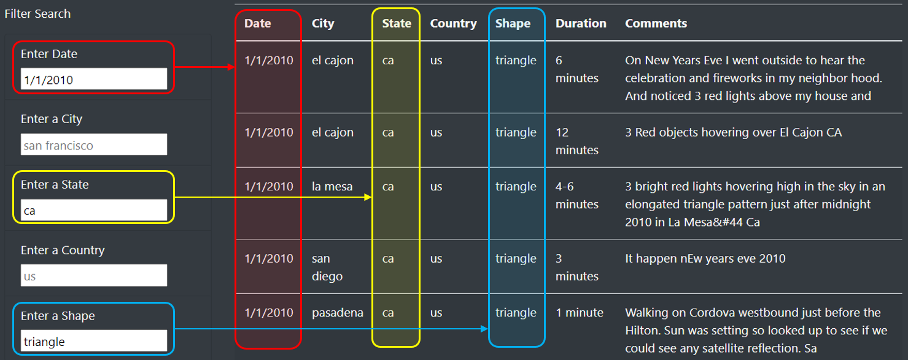

# UFO Sighting Website

## Overview

The purpose of this project was to design a website with a filterable database of UFO sightings. 

## Results

Users can enter specific search criteria in one or more boxes and the table will update showing only entries that match.

In the example below, the data has been filtered to show triangular UFO sightings in California on January 1, 2010. To reproduce the results shown below, take the following steps:
1. Type "1/10/2010" in the "Enter Date" box
2. Type "ca" in the "Enter State" box
3. Type "triangle" in the "Enter Shape" box

## Summary

Some ideas for improvement to our design include:
- Removing case sensitivity for filter criteria.
- Adding a clear/reset button to remove all filter criteria. 
- Adding sorting functionality to the columns so the data can be ordered alphabetically.

One drawback to the current design and the specific stylesheet we selected is that it is difficult to distinguish between the placeholders and the entered filter criteria due to the text colors being similar.

